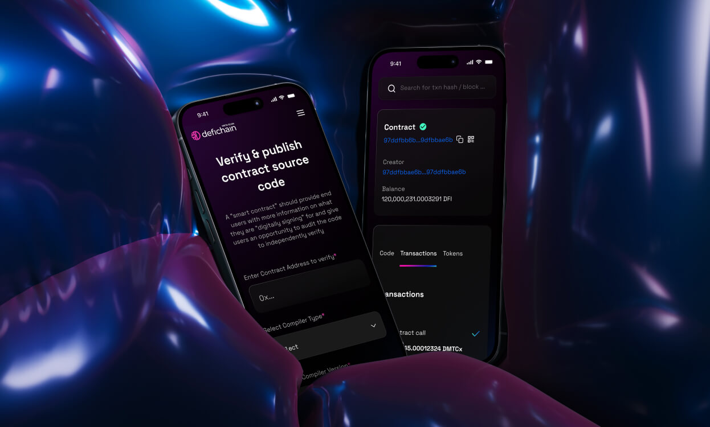
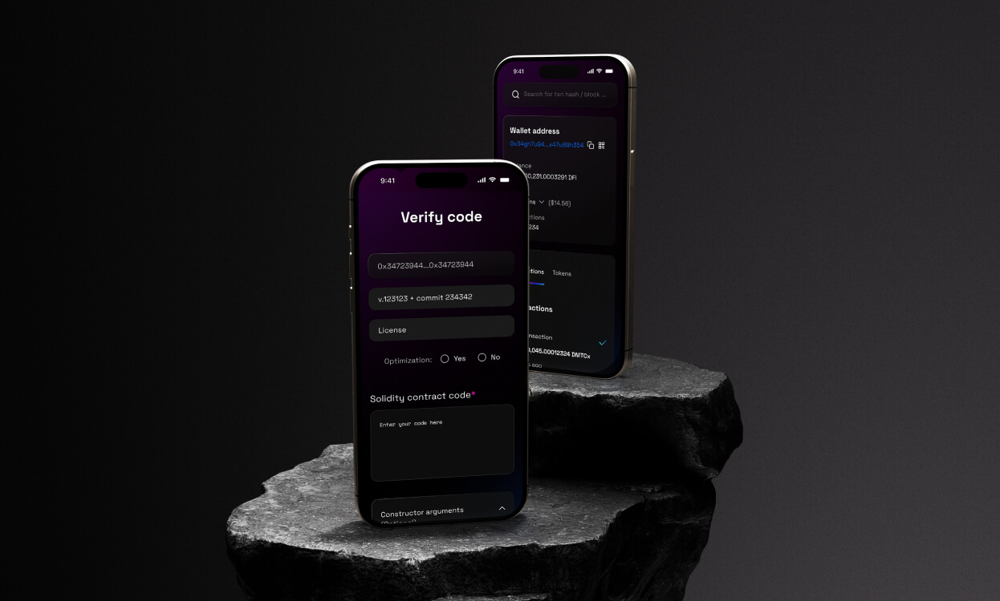
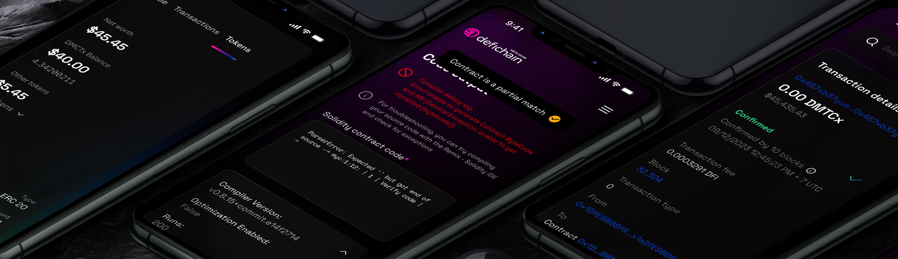

## Context

The brand at the time we started thinking of a revamp did not answer the reality of our position or  matched if the founder’s vision of an agressive, competitive exchange where risk taking traders came in.

It was meant to be a corporate, safe brand, for a retail friendly, gentle exchange. \
BitMEX was none of those nor was it planning to be in the near future.

## Strategy change

The previous branding did not leverage the strong personality and heritage of our brand, which from the user research we ran was still very much a strong asset we could lean in.

Our brand had to reflect who we were, yes, but also be aligned with our current and future position on the market. \
BitMEX was not the innovative leader it used to be and even if the teams are working tirelessly to get us back on our a-game, the brand could not be one of a futuristic brand, nor a all-inclusive one.

We needed to be edgy, to stand out. \
To back away from the corporate soft vibe, and take on an agressive, edgy, opinionated self.

We went back to the core of who we were, with a proper vision: a competitive exchange, for bold traders.

We leaned back into our heritage, our red and blue colors and our well known logo. \
It was a return to who we were with a clear vision of where we wanted to be.

## Work

The logo was barely touched during this redesign, only getting a typographic lift to make it more dynamic and modern.

We went full on into a very strong, aggressive, eye-catching color palette, using a revised version of our red and blue.

We gave the red a richer yellow input to make it more dynamic, and darkened our blue, for a more regal and serious vibe.

Akira Expanded was selected as the main font for title, diving into vintage posters and punk aesthetic.

## Outcomes

The reception from our users was overwhelmingly positive. They felt the go-getter, edgy vibe was back. Reception of new comers in crypto events was positive as well, the red standing strikingly our in the sea of dark and tamed color scheme of the crypto industry.

This rebrand helped us clarify our position, tone of voice and set a proper strategy for our products in the future.

It did what a brand is supposed to tell us: who we are, and more importantly, who we are not.

