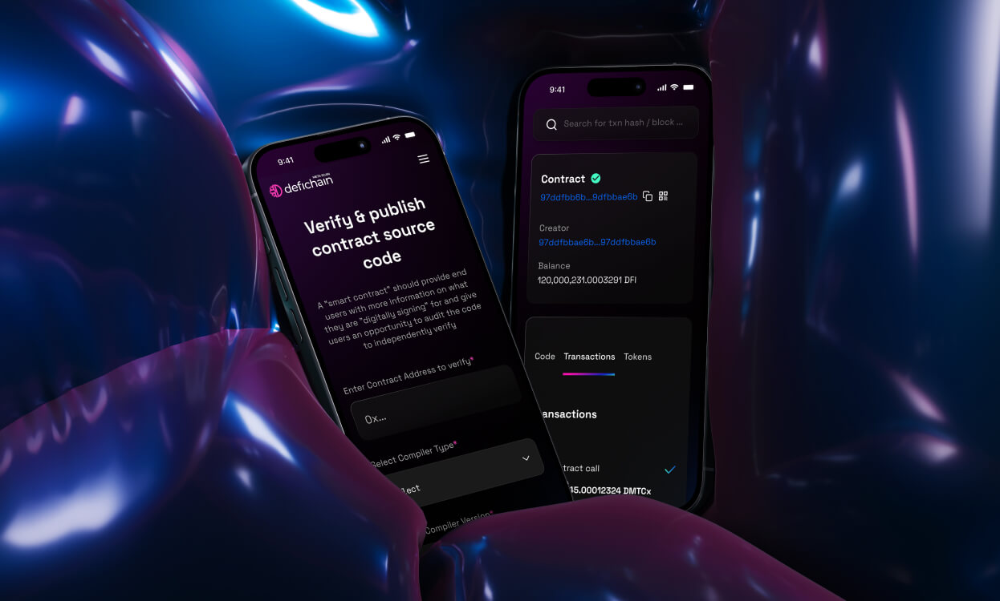
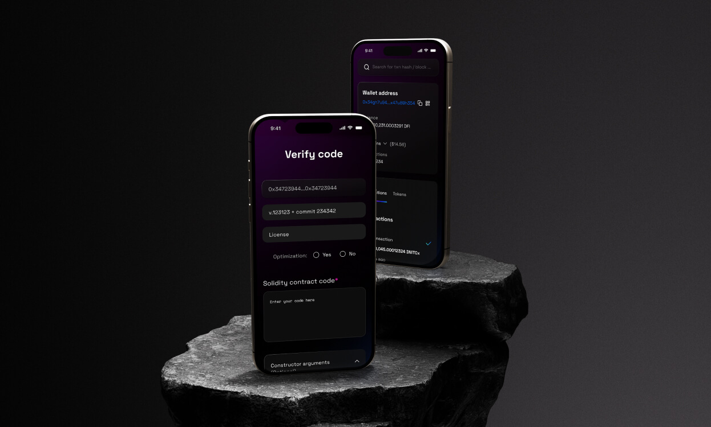
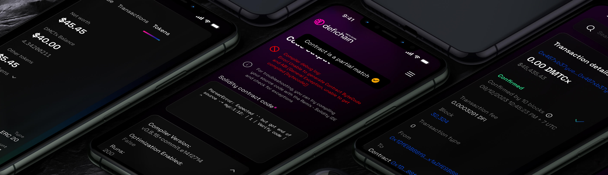

## What is a blockchain explorer

A blockchain explorer allows users to access details related to transactions on specific blockchains and wallet addresses; including amounts transacted, sources and destinations of funds, and the status of the transactions themselves.

## Where we started

We started with very little in terms of understanding of scope, users we were targeting and technical limitations. It was a very fluid workflow, with a lot left to personal initiative.

### Problem Statement

Create a viable MVP solution for a ERC20 blockchain explorer.

### Opportunities

There was an opportunity for us to learn about DefiMetaChain Potential users, What would they need from this product?

### My Responsibilities

As the Lead on this project I was responsible for overseeing the end-to-end design process including user research, validation of studies, documenting solutions, creating high quality UI designs and design system contributions and working closely with cross-functional teams to ensure that the design aligns with DefiMetaChain's design and goals.

## Desired Outcomes

By giving users a simple and smooth blockchain explorer, daily sessions, even short, to check the validity of our chain.

### Work process

We started with very little; we based our work on assumptions based on our knowledge, internal interview of blockchain explorer and attentive analysis of our competitions.

One important question was how simple did we want the Explorer to be? Would it make sense for it to be simple even, like blockchain.com ? Or did we want to introduce complexity like Etherscan?

The decisision was made for a middle of the road, which we would validate later on with user interviews.

Speed was of the essence and very little testing, apart from internal prototype could be done.

We worked hand in hand with blockchain team, in very tight feedback loops, directly into high fidelity UI and moving the information architecture and layout based on feedback.

