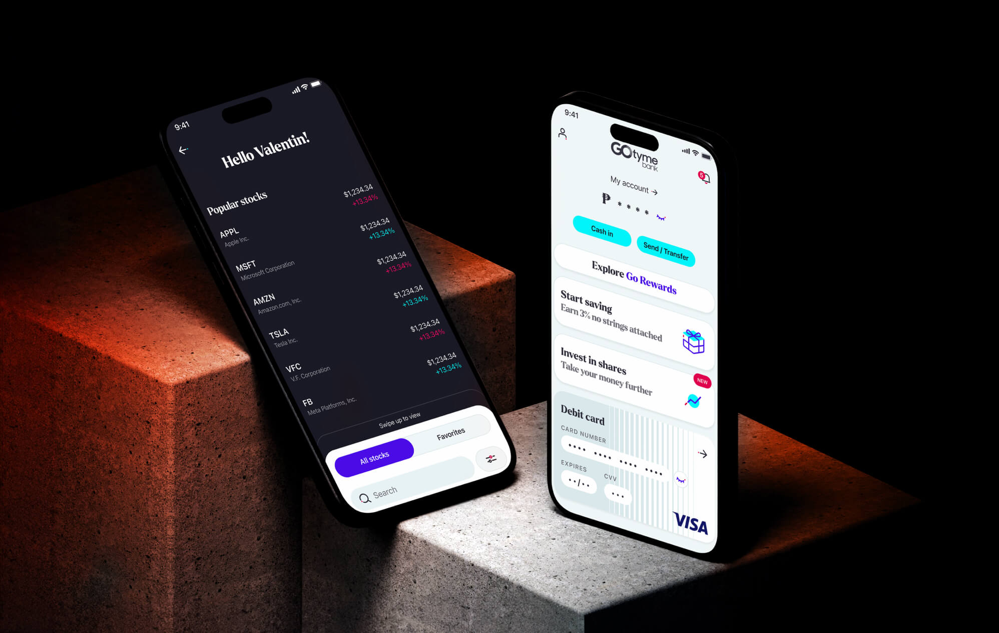
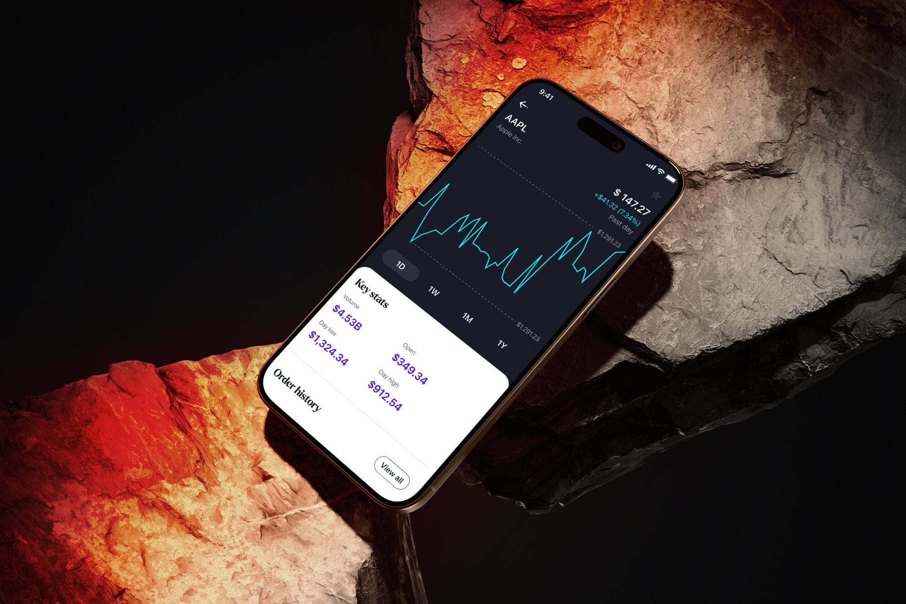

## Defining the Problem being solved

“Opening US Stocks to Filipino traders, for as little as 1$ per transaction.”

This is what Fractionnal Share is solving.

This is aligned with the overall business and product vision of Tyme Group.

## Setting up the conversation

To understand our user base and make sure our kick off process covered the right questions, we scoured all available ressources;

From scientific papers, to any data from reputable sources we could find. This created a clearer vision, both of the opportunity business was opening to, as well as the potential gain and pain of our users we needed to solve.

This helped set up the right platform to discover and explore what laid ahead.

More importantly, we created assumptions and guesses that nourished the high value questions we asked to clear the way to proper understanding with stakeholders.

## Refining our understanding

Once we understood the scope of work, the problem being solved, we turned to defining our user in more grounded details.

Our assumption was that our main user would be male, young between 25 and 30 and green retail, that would buy and hold their stocks. 

The initial offering would therefore be simple, limited to market buy / sell for the first iteration with education being a cornerstone of it.We confirmed those assumption with surveys and user interviews made by our UX researchers, with the agreable surprise of having a much more balanced share of women that is usually the case in financial products. 

We were targeting:\

* Green retail\
* 25 - 35 \
* 65/ 35 Male to female ratio\
* Mostly middle to high middle class\
* Has limited understanding of investing

## Integrating the feature in the global product suite

Before we could start the design proper, more strategic questions had to be answered:

Where would the entry point be?\
Where would it sit in the order of other products?

Should it sit above A or B product?\
How could we scale the design that was about to be made for other alike features: commodities and crypto?

How would they live together? On their own, or together as an investment portfolio?\
How would it scale on our global ecosystem, in other products?

Strategic questions that were answered using Strategic Design thinking and product mapping.

Let’s get back to design, for now.

## Following due process

Now clear on both business goals and user personas, we set our goals for our design:

Reduce the overload of information

Slowly educate users towards stocks trading

Comply to legal requirements

First we used card sorting to zero-in on the simplest, most intuitive information architecture, using a sample of 25 users, in batch of 5. 

This led to critical rework of the portfolio placement, which replaced the market page as the first things user saw once logging in, for example. 

Once we were certain of our Information architecture, low fidelity wireframes were submitted to stakeholders, leading to issue in the flow due to compliance issues, that were immediately addressed. 

This helped us confirm assumption such as “Line is easier to understand than candlestick”

## Quantitative testing 

As our opening layout was innovative, we were running the risk of backlash and resistance from the rest of the product team, rightly so. 

To make sure our take was the right one, we used batch to test different layout and assumptions or foresseen issues that were raised during meetings. 

We used Maze to run automated testing and refine our design until we cleaned up any problematic patterns, that were mostly due to lack of vibilisty of a button, lack of setting features, etc.

## Qualitative user testing

Our first user testing was done on Filipinos expat that fit our criteria for the most part, but ended too sophisticated to properly mirror our intended target.

We therefore refined our user pool and asked for support of our UX researcher in the Phillipines.
